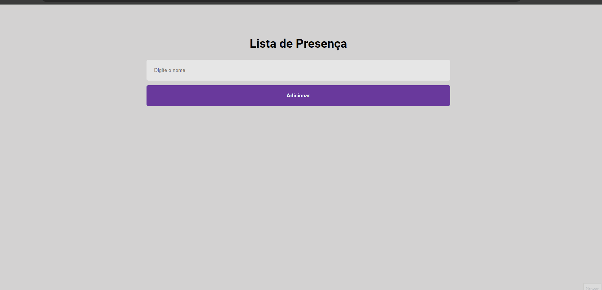

# Lista de Presença

Este projeto é uma aplicação simpels de  lista de presença, destinada a facilitar o registro de presença em um evento,  em que seja necessário acompanhar quem está presente.



## Tecnologias utilizadas

- HTML
- CSS
- JS
- REACT

# Como utilizar

Clone o projeto
```
git clone https://github.com/hpbeta/lista-de-presenca
```
Acesse a pasta do projeto
```
cd lista-de-presenca
```

No seu terminal execute o seguinte comando para instalar as dependências
```
npm install
```

Finalmente inicie a aplicação com o seguinte comando
```
npm start
```


